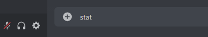

# Probability & Statistic Formula Bot
This is the discord bot that can prompt the formula according to your choice.

Below are the keyword to trigger the bot:
* stat
* stats
* formula
* cheatsheet
* statisticformula

\
To trigger the keyword, type the keyword on the input text field \

\
Formula chapter that included in this bot \

To access into chapter's formula, check out the number beside the chapter (eg: 1. Chapter 2 Descriptive Statistic). Type 1 on the input text field and it will pop out new message for you to select formula that you wish to check on.

# How to add bot into my discord server?
Check out this link to add the python bot into your own server [click me](https://realpython.com/how-to-make-a-discord-bot-python/)
